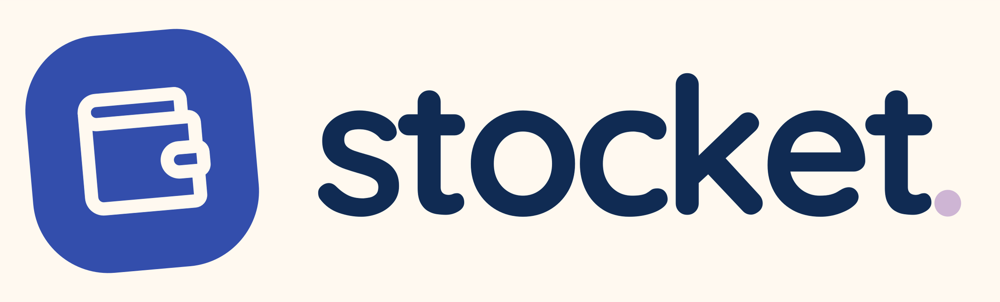
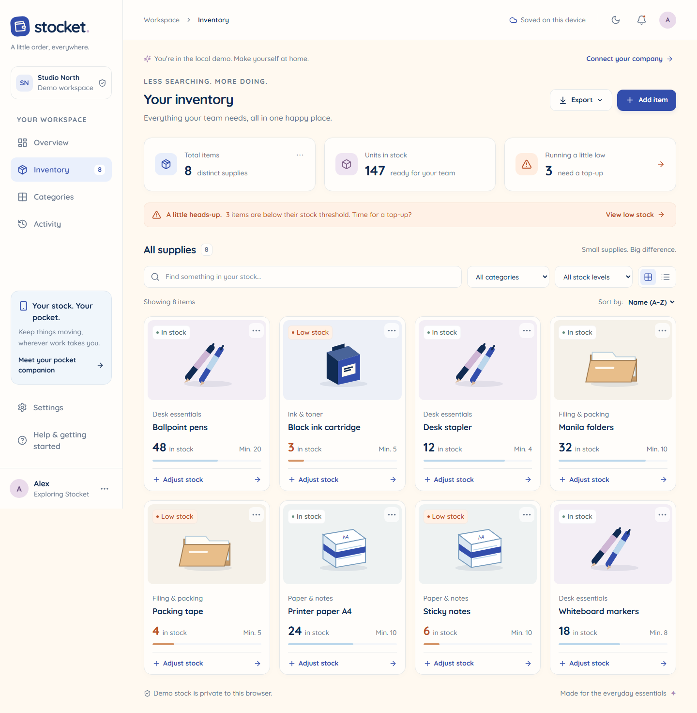
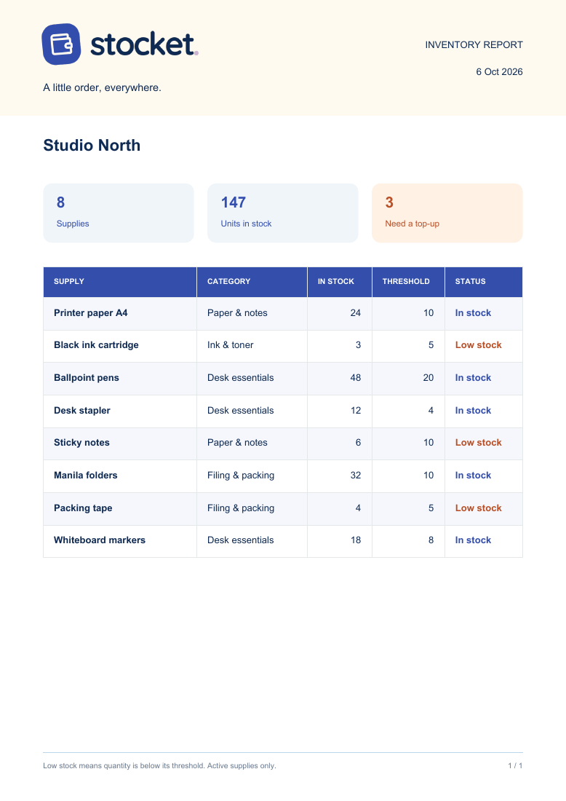

<p align="center">
  
</p>

<h1 align="center">A little order, everywhere.</h1>

<p align="center">
  <strong>The stock manager you can keep in your pocket and operate from anywhere, at any time.</strong>
</p>

<p align="center">
  Office supplies, happy teams, fewer “wait… we're out of paper?” moments.<br>
  Built for your phone. Just as handy at your desk.
</p>

<p align="center">
  <a href="#meet-stocket">Meet Stocket</a> ·
  <a href="#take-it-for-a-spin">Try the demo</a> ·
  <a href="PRODUCTION_SETUP.md">Set up your company</a>
</p>

## Meet Stocket

Paper. Pens. Printer ink. That last stapler everyone swears they put back.

Stocket gives your team one friendly place to keep track of the little things that keep work moving. See what's available, record what comes in or goes out, and spot supplies that need a top-up before someone opens an empty cupboard.

No spreadsheets to pass around. No approval queue for a box of pens. Just your stock, your team, and a little more breathing room. 💙



*A peek inside the local demo. Your connected workspace shows your own company and supplies.*

## Small app. Plenty of thoughtful touches.

| A little thing | A big help |
| --- | --- |
| **Your stock, at a glance** | An overview, searchable inventory, categories, and low-stock filters keep the cupboard easy to understand. |
| **Quick stock updates** | Add a delivery or record supplies used. Adding something you already stock tops up its count. |
| **Works through a Wi-Fi wobble** | Keep working from your saved inventory offline. Changes queue up and sync when you're connected again. |
| **A shared supply catalog** | Reuse an item's name, category, and photo instead of entering the same details all over again. |
| **Photos that are actually yours** | Take a picture with your camera or choose one from your library. No mystery stock photos. |
| **A nudge before you run out** | Set a threshold for each supply. In-app reminders show what needs attention; configured native builds can receive push alerts. |
| **An extra hand with categories** | Optional AI suggests a fitting category—or a new one you can confirm and edit. Manual categories are always welcome. |
| **Reports worth sharing** | Export CSV or a tidy, branded PDF table straight from your device. |
| **A friendly paper trail** | See recent stock movements and who made them. Removed supplies come with an undo option. |
| **Comfortable, day or night** | Light and dark themes, rounded controls, guided getting started, and draggable sheets on phones. |

<details>
<summary><strong>A peek at your next restock report</strong></summary>

<p align="center">
  
</p>

*A PDF exported from the local demo. Ready to share, print, or bring to the supply cupboard.*

</details>

## Your stock. Your pocket. 📱

Use the **React Native app on Android and iOS**, or open the **companion web app** on your laptop. Connected devices share the same company inventory, so a cupboard update on your phone can find its way back to your desk.

On iPhone or iPad, the hosted web app also works as a Home Screen companion: open it in Safari, tap **Share → Add to Home Screen**, and keep Stocket a tap away.

## A shared catalog. A private cupboard.

Companies can share useful supply details—names, categories, and photos. **Your quantities, thresholds, members, and stock activity stay within your company**, protected by database Row-Level Security.

Invite teammates by email, let them verify their address, and get moving. Everyone in the company can manage stock. Stocket keeps things simple for everyday office supplies.

Offline updates use **quantity changes**, so two people recording supplies used don't silently overwrite each other's work. Changes are designed to be safe to retry, too.

## Three steps to a calmer cupboard

1. **Find your supplies.** Search the shared catalog, or add a new item with a photo and category.
2. **Keep the count moving.** Record deliveries and supplies used; set a low-stock threshold that suits your team.
3. **Catch the little things early.** Check reminders, glance at recent activity, and share a report when it's time to restock.

That's the everyday rhythm. Stocket handles the keeping-track part. ✨

## Take it for a spin

The apps include a **persistent local demo**, so you can explore before connecting any services. Demo stock stays on your device and is clearly labeled.

With **Node.js 22+ and npm** installed:

```sh
git clone https://github.com/oldVinyl/Stocket.git
cd Stocket
npm ci
npm run dev
```

Open [localhost:3000](http://localhost:3000) and make yourself at home.

For the native app, open another terminal in the project root:

```sh
npm run mobile
```

Scan the QR code with **Expo Go for SDK 57**. Remote push notifications and native passkeys require a configured native build; the demo's inventory, camera, and local exports can be explored in Expo Go.

## Make it yours to run

Ready to give your team its own cupboard? Follow the step-by-step **[production setup and deployment guide](PRODUCTION_SETUP.md)**. It covers the database, verified email sign-in, company invitations, web hosting, Android APK builds, and optional AI and notifications.

This repository contains the apps and deployment instructions. A hosted service and downloadable APK need to be configured and published by the operator. **AI suggestions, push alerts, and email delivery need their service credentials**; the local demo works without them.

For development, sync behavior, service details, and checks, see **[DEVELOPMENT.md](DEVELOPMENT.md)**. The foundation is Expo + React Native, Next.js, Supabase, SQLite, and IndexedDB, with Quicksand and a very soft spot for rounded corners.

Found something that could feel better? [Open an issue](https://github.com/oldVinyl/Stocket/issues). Little improvements are very much the point.

<p align="center"><strong>Less hunting for supplies. More getting on with your day.</strong><br>Made with a little order, and a lot of care. 💙</p>
